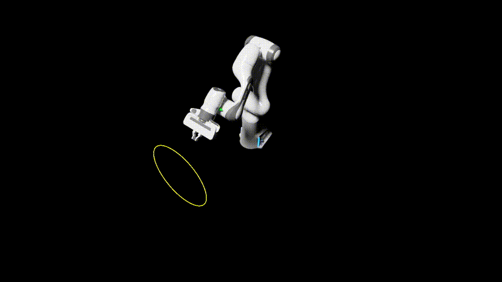
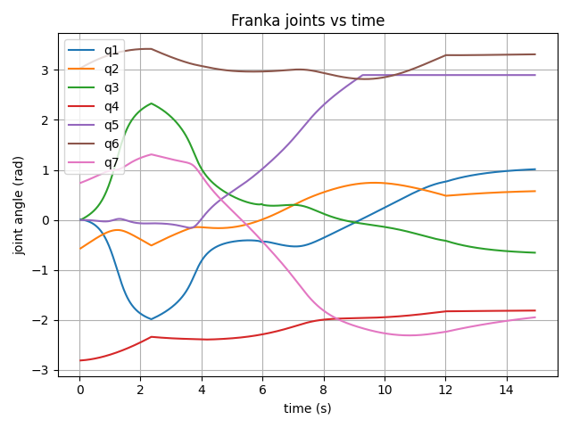

# Franka 7dof arm Kinematics analysis

A demonstration of Franka Panda robot kinematics using NVIDIA Isaac Sim. The extension performs kinematics experiments with the franka panda 7dof arm.


<table>
<tr>
<td></td>
<td></td>
</tr>
<tr>
<td align="center"><b>Objective A</b></td>
<td align="center"><b>Objective B</b></td>
</tr>
</table>

### Objective A

- **Task Space Sampling**: Generates random poses within a defined cuboid workspace
- **Reachability using solver**: Tests each sampled pose for reachability using Lula Inverse_kinematics solver
- **Visualization**: 
  - Green frames indicate successful IK solutions (reachable poses)
  - Red frames indicate that IK didn't converge (unreachable poses)
  - Yellow wireframe shows the task space boundary
- **Target Cycling**: arm automatically moves through all sampled targets validating if the reachable poses are indeed reachable
### Objective B
- **Task space path generated**: used the inherent interpolating functions in lula, to create task space path from 5 waypoints that form a line + circle path
- **Jacobian IK** Pseudo inv/dls inverse of Jacobian is calculated for obtaining target joint velocities
- **Redundance handling** Redundance is exploited to improve manipulability by moving towards the direction that maximizes least singular value of jacobian/ to preserve a nominal robot pose desired, set as intial position by default

- **Continuous joint Motion logging**: Logged all 7 joint postions, demonstrating continuous smooth path

<div align="center">

</div>

## Tested on

- NVIDIA Isaac Sim 5.x ([Documentation](https://docs.isaacsim.omniverse.nvidia.com/5.1.0/index.html))
- Required Isaac Sim extensions:
  - `lula`
  - `isaacsim.robot_motion.motion_generation`
  - `isaacsim.util.debug_draw`
  - `isaacsim.core.utils`
  - `matplotlib`


## Installation

1. Clone this repository into your Isaac Sim `extsUser` directory:
   ```bash
   cd <isaac-sim-path>/extsUser
   git clone <repository-url> kinematics_analysis
   ```

2. Launch Isaac Sim

3. Enable the extension:
   - Window → Extensions
   - Search for "kinematics_analysis"
   - Enable the extension

## Usage

- Click the corresponding load scenario button to play the objective
- click run/stop to play and pause the scenario
- Click on Reset for plot visualiziation for Objective B

## Working further on
- Dynamics instead of just kinematics
- Integrating Moveit, RoS 2 with IsaacSim for a more realistic workflow

