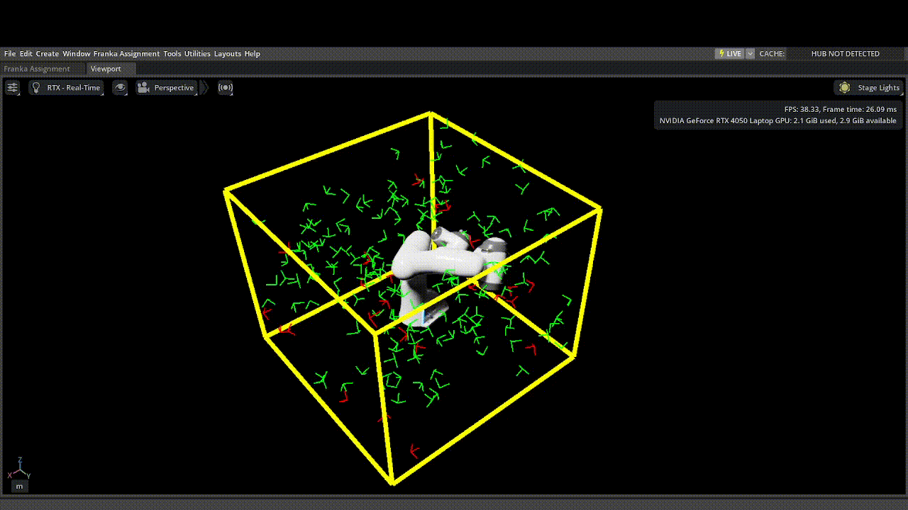

# Franka Assignment

A demonstration of Franka Panda robot kinematics using NVIDIA Isaac Sim. The extension performs kinematics experiments with the franka panda 7dof arm.

## Objective A(Implemented so far)



- **Task Space Sampling**: Generates random poses within a defined cuboid workspace
- **IK Validation**: Tests each sampled pose for reachability using Lula kinematics solver
- **Visualization**: 
  - Green frames indicate successful IK solutions (reachable poses)
  - Red frames indicate that IK didn't converge (unreachable poses)
  - Yellow wireframe shows the task space boundary
- **Target Cycling**: arm automatically moves through all sampled targets validating if the reachable poses are indeed reachable
  - Prioritizes unreachable poses first
  - Resets to default pose between targets
  - Loops infinitely through all samples

## Tested on

- NVIDIA Isaac Sim 5.0.0 
- Required Isaac Sim extensions:
  - `isaacsim.robot_motion.motion_generation`
  - `isaacsim.util.debug_draw`
  - `isaacsim.core.utils`

## Installation

1. Clone this repository into your Isaac Sim `extsUser` directory:
   ```bash
   cd <isaac-sim-path>/extsUser
   git clone <repository-url> franka_assignment
   ```

2. Launch Isaac Sim

3. Enable the extension:
   - Window → Extensions
   - Search for "Franka Assignment"
   - Enable the extension

## Usage

1. Click "Load Scenario A" to load the Franka robot and generate task space samples
2. Click "Run Scenario A" to start automatic target cycling

